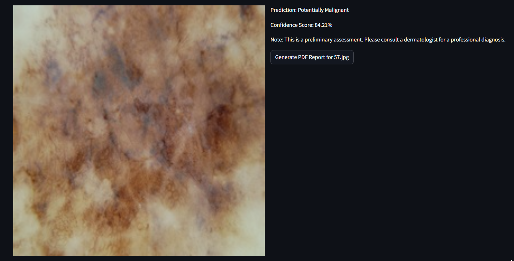
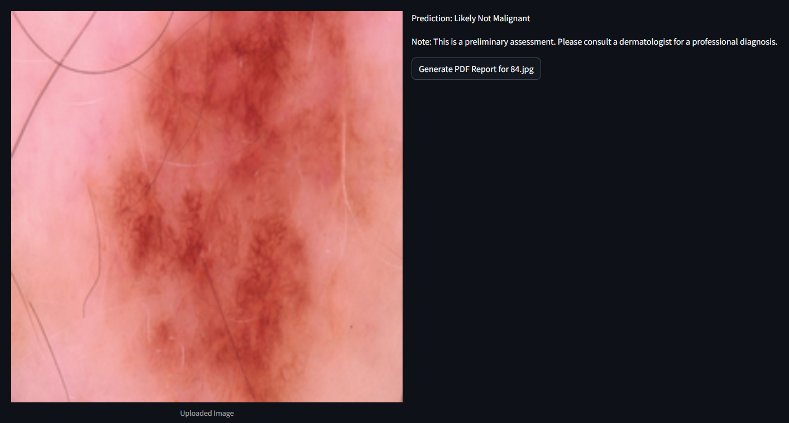
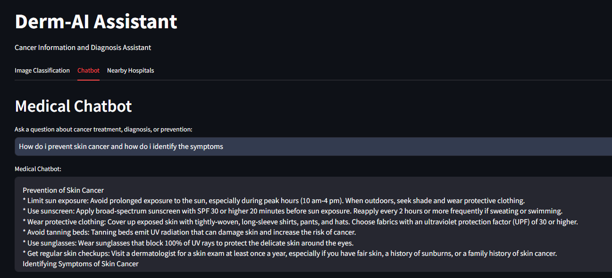
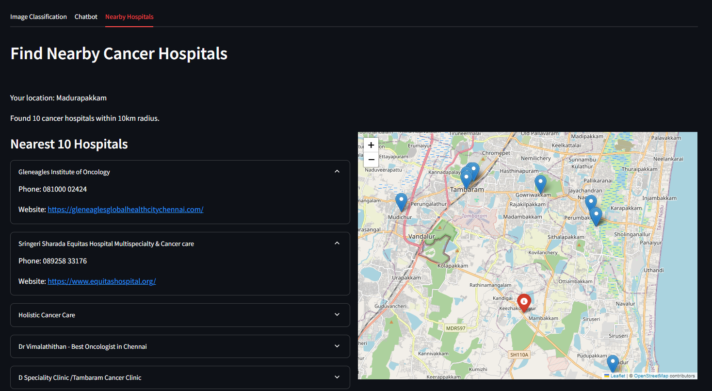
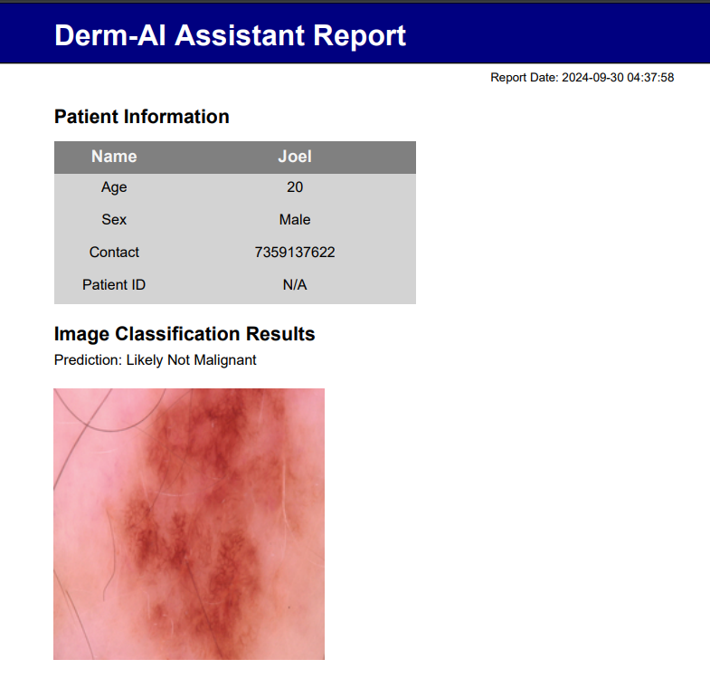

DermAI 🌟

"Where AI meets Dermatology for Early Cancer Detection"

DermAI is your digital assistant for skin cancer detection, helping users by providing preliminary image-based diagnostics, cancer-related information, and nearby hospital recommendations.

Key Features :

🖼️ Image Classification
Upload up to 3 skin images.
Our deep learning model identifies whether the images show signs of skin cancer.
Accurate predictions with easy-to-understand results.




🤖 Medical Chatbot
Powered by the Gemini chatbot API which is finetuned to be a medical chatbot in this case, this feature provides instant responses to your cancer-related questions.
Ask anything about treatment options, preventive measures, or early symptoms.



🌍 Find Nearby Hospitals
Automatically detects your location.
Provides a list of nearby cancer hospitals within a 10km radius.
View hospitals on an interactive map with contact and website details.



🛠️Report Generation:       



🎨 User Interface
The interface is designed with simplicity and clarity in mind, allowing users to effortlessly navigate the different features. 

🛠️ Technologies Used

Python: Core programming language for the app.

Streamlit: Framework for building the user interface.

TensorFlow: For building and deploying the CNN-based image classification model.

Google Maps API: To locate nearby cancer hospitals based on geolocation.

ReportLab: Generates PDF reports for download.

Folium: Displays interactive maps for hospital locations.


Check out our working website : [Derm-AI](https://derm-ai-medithon.streamlit.app/)

# DermAI

## 🚀 Getting Started

### 1. Clone the repository

```bash
git clone https://github.com/your-username/derm-ai-assistant.git
cd derm-ai-assistant
pip install -r requirements.txt
weights.h5
gmaps = googlemaps.Client(key="YOUR_GOOGLE_MAPS_API_KEY")
genai.configure(api_key="YOUR_GEMINI_API_KEY")
streamlit run app.py

